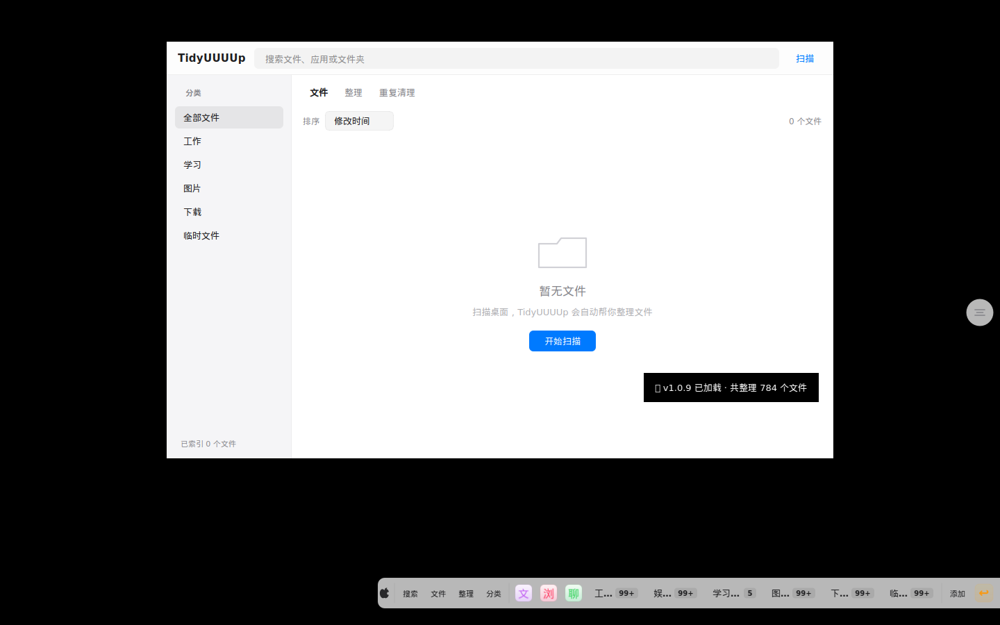
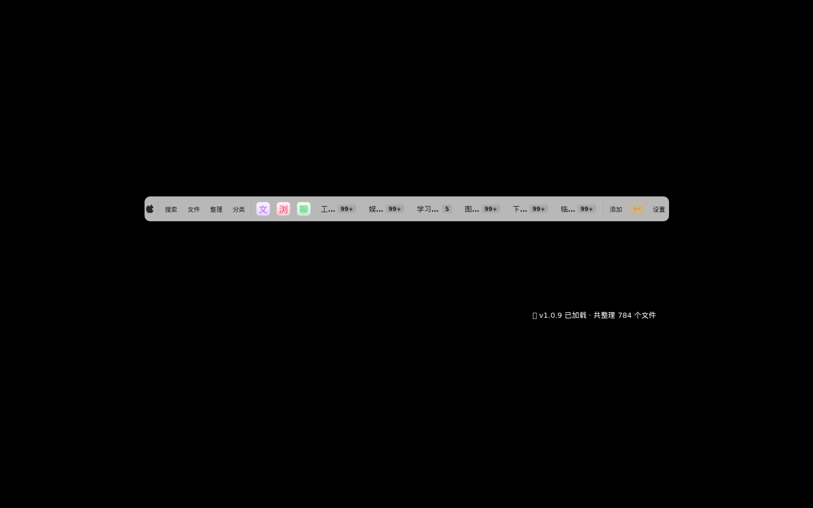
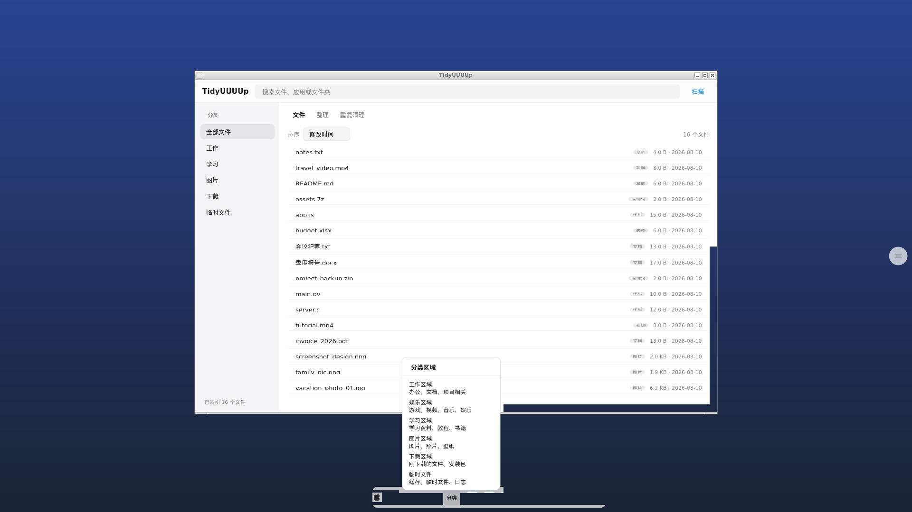
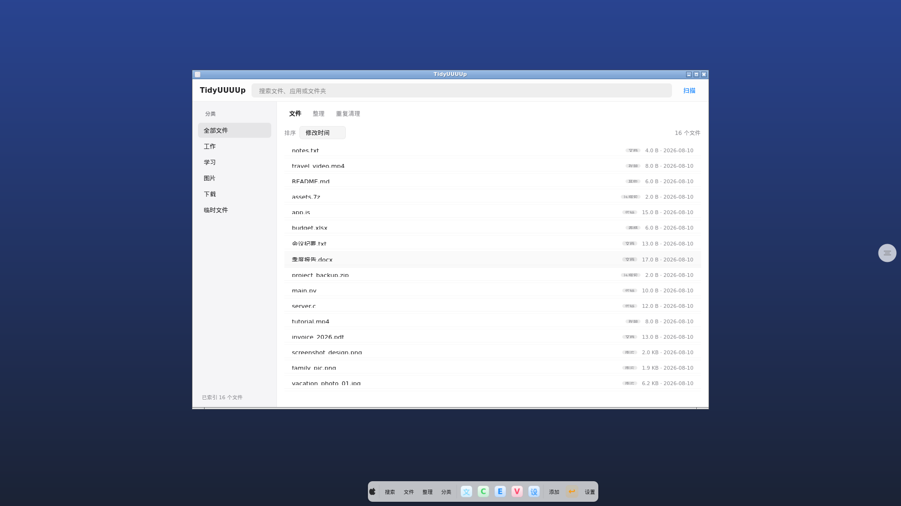

# TidyUUUUp

> macOS 原生风格的桌面整理工具

## 当前版本：v1.0.12

### 🆕 v1.0.12 更新检测 + 流畅度版（最新）

在 v1.0.11 可用版基础上新增 **GitHub 自动更新检测**与多项**流畅度优化**，且完全保留用户数据：

- 🔄 **GitHub 更新检测**：启动后台检测 GitHub 最新 Release，语义化比较版本号，可识别 `v1.0.12` / `1.1.0` / `2.0.0` 等任意高位版本；弹出更新对话框（changelog + 下载进度 + 跳过此版本）；24h 冷却不打扰。
- 🔒 **用户数据 100% 保留**：设置保存在独立目录，更新包仅下载到「下载」目录，绝不触碰用户数据；桌面位置/偏好跨版本保留。
- ⚡ **流畅度**：搜索防抖 250ms、桌面扫描改用 mtime 检测 + 后台 QThread（UI 不卡顿）、弹簧动画改用 OutQuint 曲线、Popover 改为常驻悬浮面板。

详见 [v1.0.12/README.md](./v1.0.12/README.md)

---

### 🏝️ v1.0.11 灵动岛 Dock（可用性修复）

基于 PyQt6 重构的 Apple Dynamic Island 风格底部悬浮 Dock。本次更新让 UI 真正可用：真实扫描桌面文件、文件夹 Popover 展示真实文件、搜索框模糊匹配真实文件名、固定应用按钮可点击、无边框窗口可拖动、系统托盘 + 右键菜单。

核心特性：
- Windows 10/11 原生 Acrylic 毛玻璃（DWM API）
- Apple Spring Physics 弹簧伸缩动画（560 → 780px）
- 矢量绘制 Apple 蓝文件夹图标（无 Emoji）
- AI 虚拟目录映射 + 语义搜索 Popover

详见 [v1.0.11/README.md](./v1.0.11/README.md)

---

### 🎨 v1.0.10 macOS 原生视觉设计系统

重新建立完整的视觉设计系统，从「网页文件管理器 + Windows Dock + 彩色胶囊按钮」彻底改为「真正的 macOS 原生桌面工具」。

关键词：克制 · 留白 · 层次 · 安静

## 截图预览

### 主界面 + Dock + 悬浮球

### Dock 栏特写

### Dock + 分类区域弹出（按需展开）

### 悬浮球 + 文件夹按钮状态

### 完整桌面视图

## 设计系统

### 色彩
| 角色 | 色值 | 用途 |
|---|---|---|
| Background | `#F5F5F7` | 接近白的浅灰背景 |
| Window | `#FFFFFF` | 纯白窗口 |
| Primary Text | `#1D1D1F` | 深灰文字（非纯黑） |
| Secondary | `#86868B` | 中灰次要文字 |
| Tertiary | `#AEAEB2` | 浅灰辅助文字 |
| Border | `rgba(0,0,0,0.06)` | 极淡边框 |
| Accent | `#007AFF` | 系统蓝强调色 |

### 圆角层级
- 窗口：12px
- 卡片：10px
- 按钮：6px
- Badge：4px

### 字体
`-apple-system, SF Pro Text, SF Pro Display, PingFang SC`

## 核心改动

### 主窗口
- 顶部栏 48px：纯文字 Logo + Spotlight 风格搜索框 + 轻量扫描按钮
- 左侧 Sidebar 180px：纯文字分类项，选中项用淡背景高亮
- 内容区：白色背景 + 文字按钮视图切换 + 极简文件列表
- Empty State：文件夹轮廓图标 + 暂无文件 + 说明 + 开始扫描

### Dock
- 浮动式 44px 高度，半透明背景
- 10px 圆角，1px 极淡边框，4 层柔和阴影
- 文字按钮：搜索 / 文件 / 整理 / 分类 / 添加 / 设置

### 悬浮球
- 40×40 极简灰色半透明圆球
- 3 条水平线图标，移除彩虹光晕与呼吸动画
- 保留拖动 + 左右边缘吸附

## 下载

- **EXE 发布包**：[Releases 页面](https://github.com/BigCake2026/TidyUUUUpCode/releases)
- **源码**：[v1.0.10 目录](./v1.0.10/)

## 自动打包

本项目使用 GitHub Actions 在 Windows 环境自动打包 EXE。详见 [打包说明](./.github/workflows/build-windows-exe.yml)。

手动触发：
1. 打开 [Actions 页面](https://github.com/BigCake2026/TidyUUUUpCode/actions)
2. 选择 **Build Windows EXE** workflow
3. 点击 **Run workflow**，填写版本号 `v1.0.10`
4. 等待构建完成后在 Releases 下载

## 设计哲学

围绕「扫描 → 查看 → 整理」三个核心动作设计，其他功能全部弱化。

少一点 UI，多一点空间。
少一点装饰，多一点层次。
少一点按钮，多一点内容。
少一点颜色，多一点质感。
