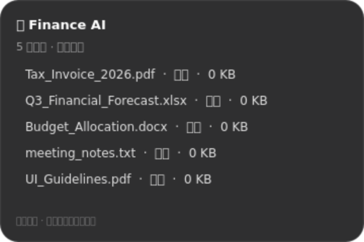
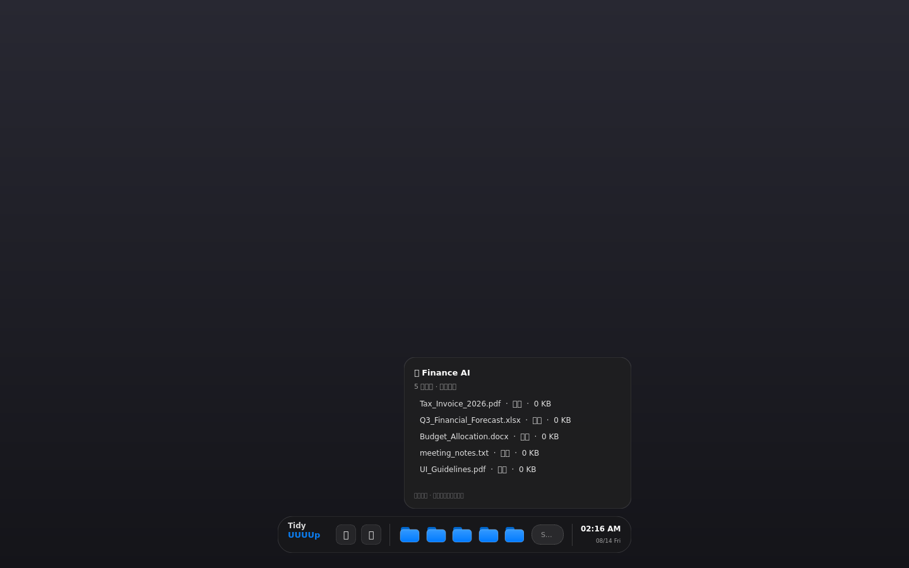
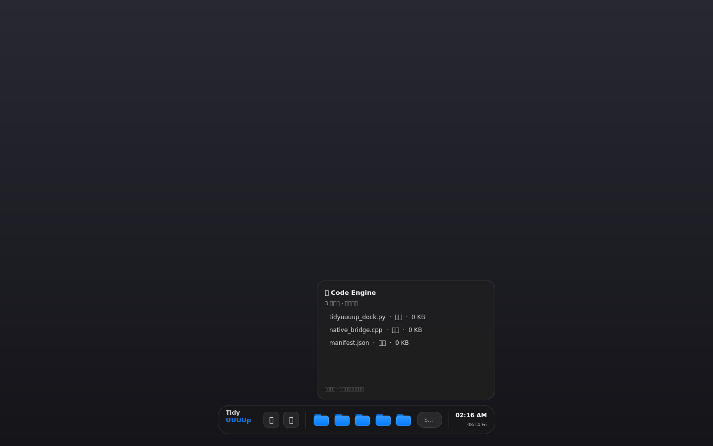

# TidyUUUUp v1.0.11 - Dynamic Island Dock

> 灵动岛风格 Dock，基于 PyQt6 重构

## 截图预览

### Dock 默认 Compact 状态（1120×116 高清）


### 搜索框聚焦 → 弹簧拉伸（560 → 780px）


### 搜索框输入文字 + 实时语义搜索


### 文件夹 Popover 弹出面板（AI 虚拟目录内容）


### 完整桌面合成视图


### Dock + Popover 组合视图


> 截图在 Linux offscreen 平台生成（Windows Acrylic 效果仅在 Windows 10/11 上生效，截图中为普通半透明背景）。

## 核心特性

### 🏝️ 灵动岛 Dock
- 底部悬浮式工具栏，半透明深色玻璃底板
- Apple Spring Physics 弹簧伸缩动画
- 搜索框聚焦时宽度从 560px 弹性拉伸到 780px
- **可拖动**：按住空白区域拖动 Dock 位置

### 🪟 Windows 原生 Acrylic 毛玻璃
- 通过 `ctypes` 调用 Windows `user32.SetWindowCompositionAttribute` API
- 启用 `ACCENT_ENABLE_ACRYLICBLURBEHIND` (状态 4)
- 深色模式背景色 `0xCC1E1E20`
- 非 Windows 平台自动降级为 QPainter 半透明玻璃底板

### 📁 Apple 矢量蓝文件夹
- 用 `QPainterPath` 矢量绘制，不使用 Emoji
- 蓝色渐变主体（`#3399FF` → `#007AFF`）+ 后背板 tab
- hover 高光反馈
- 点击弹出 **真实桌面文件** 的 AI 虚拟目录分类

### 🔍 真实桌面扫描 + 模糊搜索
- 启动时扫描用户桌面（`QStandardPaths` / SHGetKnownFolderPath，跨平台）
- 按扩展名 + 关键词本地分类（无需联网 / AI）
- 搜索框基于真实文件名做模糊匹配 + 相似度评分，实时显示结果
- Popover 双击打开文件 / 右键在文件夹中显示 / 复制路径 / 移到回收站

### 🕐 常驻时钟
- 右下角嵌入时间（`hh:mm A`）+ 日期（`MM/dd ddd`）
- 每秒刷新

### 📌 固定应用（真正可点击）
- 🌐 浏览器：打开系统默认浏览器
- 💻 终端：打开系统默认终端（Windows Terminal / Terminal.app / xterm 等）

### 🧰 系统托盘 + 右键菜单
- 托盘图标：显示 Dock / 重新扫描 / 关于 / 退出
- Dock 右键菜单：重新扫描桌面 / 关于 / 退出
- 每 15 秒自动重新扫描桌面

## 组件结构

```
main.py
├── DesktopIndex             # 真实桌面扫描 + 本地分类 + 模糊搜索
├── StackedLogoWidget        # Tidy / UUUUp 品牌堆叠 Logo
├── AppleVectorFolderIcon    # 矢量蓝文件夹图标（可点击 + hover）
├── TopPopoverPanel          # 悬浮毛玻璃弹出面板（真实文件 + 右键菜单）
└── TidyDynamicIslandDock    # 灵动岛主窗口
    ├── Pinned Apps          # 固定应用（浏览器、终端，真正可点击）
    ├── AI Virtual Folders   # 5 个虚拟目录文件夹（映射真实桌面文件）
    ├── Search Pill          # 药丸型搜索框（真实模糊匹配）
    └── Clock                # 时钟日期
└── 系统托盘 + 右键菜单       # 显示 / 重新扫描 / 关于 / 退出
```

## 运行

### 依赖
```
PyQt6>=6.5.0
```

### 启动
```bash
pip install -r requirements.txt
python main.py
```

> **注意**：Windows Acrylic 效果仅在 Windows 10/11 上生效，其他平台会自动降级为普通半透明背景（不影响功能）。

## Bug 修正记录

### 1. `pyqtProperty` 未导入（已修正）
**问题**：原代码在 `TidyDynamicIslandDock` 类中使用了 `pyqtProperty(int, get_dock_width, set_dock_width)` 来定义 `dockWidth` 属性（供 `QPropertyAnimation` 动画使用），但未从 `PyQt6.QtCore` 导入 `pyqtProperty`，导致运行时 `NameError`。

**修正**：在导入列表中添加 `pyqtProperty`：
```python
from PyQt6.QtCore import (..., pyqtSignal, pyqtProperty)
```

## 技术栈

- **PyQt6**（从 v1.0.10 的 PyQt5 升级）
- **ctypes** 调用 Windows `user32` DWM API
- **QPropertyAnimation** + **QEasingCurve.OutBack** 实现弹簧回弹动画
