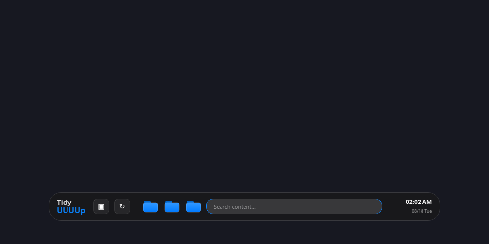
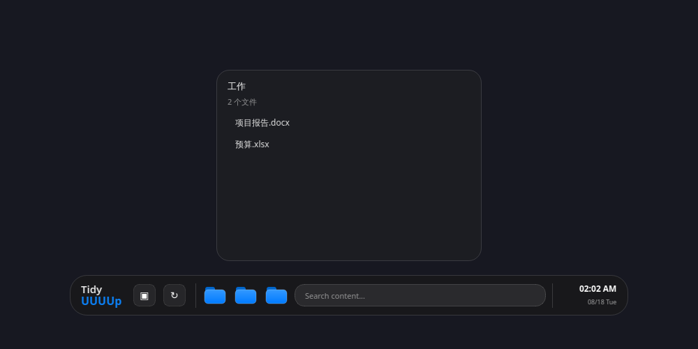

# TidyUUUUp v1.1.2

> **Classic UI and One-Click Installer Edition**：恢复改版前的小岛界面，并提供双击即可安装的 Windows 安装程序。


## 运行截图

| 经典默认布局 | 搜索展开 |
| --- | --- |
|  |  |

| 工作文件 | 本地搜索结果 |
| --- | --- |
|  |  |

截图使用临时桌面中的真实文件索引生成，展示文件夹与搜索的实际功能流。Windows 上的 Acrylic 效果会随系统环境呈现。

## 经典小岛界面

v1.1.2 恢复经典的横向结构：左侧双行 `Tidy / UUUUp` 标识，随后是“全部文件”和“重新扫描”控制、三枚蓝色文件夹、搜索框，以及右侧的时间和日期。小岛默认显示在桌面底部中央，搜索聚焦时保持原有的弹性展开效果。

| 界面元素 | 对应功能 |
| --- | --- |
| 两个固定控制 | 查看全部桌面文件、重新扫描本地索引。 |
| 三枚蓝色文件夹 | 分别查看工作、图片和代码类别的真实桌面文件。 |
| 搜索框 | 本地匹配真实文件名；按 `Esc` 清空并收起。 |
| 时钟与日期 | 仅显示系统时间，不访问网络。 |
| 右键菜单与托盘 | 提供媒体文件、恢复居中、更新检查和退出等低频操作。 |

## 本地文件边界

TidyUUUUp 只在本地读取桌面目录并按扩展名分类。双击文件可使用 Windows 默认程序打开；右键菜单支持在文件夹中显示、复制路径，并在已安装 `send2trash` 时显式移动到回收站。程序不会自动整理、移动、重命名、上传或删除任何用户文件。

## 双击安装 Windows 版本

请从 GitHub Release 下载单个 `TidyUUUUp_Setup_v1.1.2.exe` 文件并双击。安装程序会将应用安装到当前用户的本地应用目录，并自动创建带正式品牌图标的 **桌面快捷方式** 与 **开始菜单入口**；安装完成后可直接启动应用。无需解压 ZIP，也无需手动运行 PowerShell 脚本。

安装包内嵌 `TidyUUUUp.exe`，同时保留应用首次启动时的快捷方式修复逻辑。如果以后移动已安装程序，程序会尝试将同名桌面快捷方式更新到正确路径。

## 从源码构建安装程序

以下步骤仅供维护者在 Windows 上使用。GitHub Actions 已自动执行同一流程。

```powershell
python -m pip install -r requirements.txt pyinstaller
choco install innosetup --yes
python ..\scripts\build_windows_release.py
```

构建将生成 `release/TidyUUUUp_Setup_v1.1.2.exe` 和对应的 SHA-256 文件。

## 目录说明

| 文件或目录 | 作用 |
| --- | --- |
| `main.py` | 经典小岛、真实桌面分类、搜索、文件操作、托盘和快捷方式修复逻辑。 |
| `installer.iss` | Inno Setup 安装描述，负责安装目录、开始菜单与桌面快捷方式。 |
| `assets/tidyuuuup_app_icon.ico` | EXE、安装程序、桌面和开始菜单快捷方式共用的正式品牌图标。 |
| `create_shortcut.ps1` | 应用运行时用于修复或刷新快捷方式的辅助脚本。 |
| `take_screenshots.py` | 生成默认、搜索、文件夹和搜索结果四种离屏截图。 |
