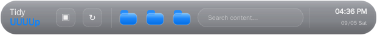
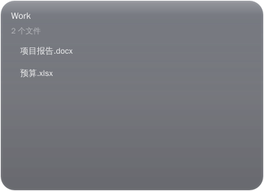
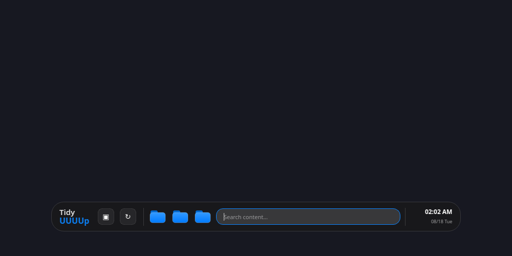
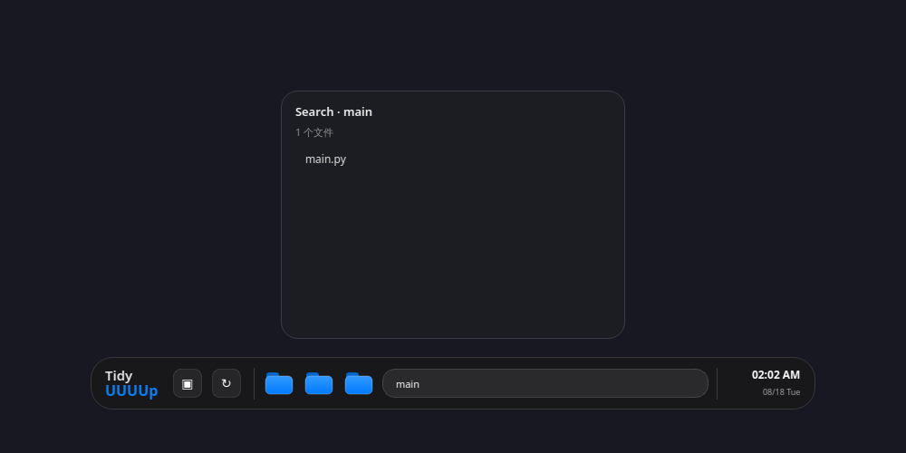

# TidyUUUUp v2.0.0
> **Liquid Glass 系列首发**：全新系列版本，UI 全面采用苹果 Liquid Glass 设计语言，功能与 v1.x 完全一致。



## 系列说明

| 系列 | 版本 | UI 风格 |
| --- | --- | --- |
| 经典系列 | v1.0.x – v1.1.x | Classic UI，经典小岛 |
| **Liquid Glass 系列** | **v2.0.0 起** | 苹果 Liquid Glass 通透玻璃 |

v2.0.0 仅重写 UI 绘制层，所有功能逻辑与 v1.1.2 完全一致。

## 运行截图

| Liquid Glass 小岛 | 弹出面板 |
| --- | --- |
|  |  |
| 搜索展开 | 搜索结果 |
|  |  |

> Windows 上的 Acrylic 效果会实时透出桌面背景，形成真正的 Liquid Glass 通透感。上方截图为离屏渲染，未启用系统亚克力。

## Liquid Glass 设计升级

| UI 元素 | Liquid Glass 改进 |
| --- | --- |
| 主小岛背景 | 垂直深度渐变（顶部亮、底部暗），alpha 119-152，通透透出桌面 |
| 顶部高光 | 白色镜面渐变带，模拟玻璃表面反光 |
| 边缘边框 | 外层折射高光（alpha 55）+ 内层微妙边框，双层玻璃感 |
| 底部内阴影 | 深色渐变，增加悬浮深度 |
| 弹出面板 | 同步升级为 Liquid Glass 材质，更通透 + 顶部高光 + 双层边框 |
| 文件夹图标 | 玻璃质感蓝色渐变 + 顶部高光 + 折射边缘，悬停时更亮 |
| 搜索框 | 玻璃质感，hover 微亮，聚焦时苹果蓝光晕边框 |
| 固定按钮 | 玻璃质感半透明，悬停高亮 |
| 应用图标 | 蓝色玻璃渐变 + 顶部高光 + 白色 Tidy 标识 |
| 系统亚克力 | `AccentPolicy` 蓝灰调（`0x771E2230`），与 Liquid Glass 协调 |

## 功能完全保留

v1.x 的全部功能不受影响：

| 界面元素 | 对应功能 |
| --- | --- |
| 两个固定控制 | 查看全部桌面文件、重新扫描本地索引。 |
| 三枚蓝色文件夹 | 分别查看工作、图片和代码类别的真实桌面文件。 |
| 搜索框 | 本地匹配真实文件名；按 `Esc` 清空并收起。 |
| 时钟与日期 | 仅显示系统时间，不访问网络。 |
| 右键菜单与托盘 | 提供全部文件、恢复居中、更新检查和退出等操作。 |
| 文件操作 | 双击打开、在文件夹中显示、复制路径、可选移到回收站。 |

## 本地文件边界

TidyUUUUp 只在本地读取桌面目录并按扩展名分类。程序不会自动整理、移动、重命名、上传或删除任何用户文件。

## 安装与更新

从 GitHub Release 下载 `TidyUUUUp_Setup_v2.0.0.exe` 双击安装。安装程序只替换应用目录，`%APPDATA%/TidyUUUUp/settings.json` 和用户数据保持不变。

## 从源码构建

```powershell
python -m pip install -r requirements.txt pyinstaller
choco install innosetup --yes
python ..\scripts\build_windows_release.py
```

## 目录说明

| 文件或目录 | 作用 |
| --- | --- |
| `main.py` | Liquid Glass 小岛、真实桌面分类、搜索、文件操作、托盘逻辑。 |
| `settings.py` | 用户设置持久化。 |
| `updater.py` / `update_dialog.py` | GitHub Release 检查与更新对话框。 |
| `installer.iss` | Inno Setup 安装描述。 |
| `assets/` | 品牌图标资源。 |
| `screenshots/` | UI 截图（含 Liquid Glass 新版与经典版对比）。 |
